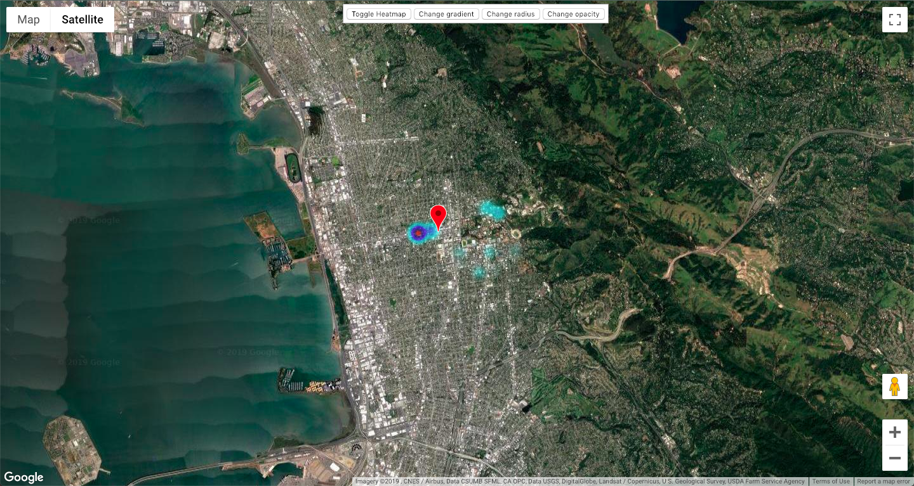

# Customer Heatmap



## Summary

Taking output from a dummy business' Microsoft Access customer database, wrote scripts that use the Google Maps API to geocode customers' addresses (I used a dataset for Berkeley, CA). Used the total amount that each customer had spent at the business to weight each coordinate and calculate a weighted mean center. Created a heatmap with all of this information and plotted the weighted mean center with a marker. Potential application for a business: If a business needed to change locations or add a new location, they could use this program to figure out where an optimal new location would be.

## How to use

### Prerequisites

Make sure python3 is installed.
```
$ pip3 install geopy
```

### Running the code
```
$ python3 addresses.py
$ python3 weightedmeancenter.py
$ python3 formatCoordinates.py
```
Then open `heatmap.html` to see the data all plotted! 

### Using different dataset

Edit `importedAddresses.txt` to contain your dataset. Format shouldn't change.

## Extensions I plan to do

- Host it online and let users upload a `importedAddresses.txt` file to produce heatmap completely in-browser
- Add more functionality to benefit business (e.g. what if they're not relocating but rather opening up an additional location?)
